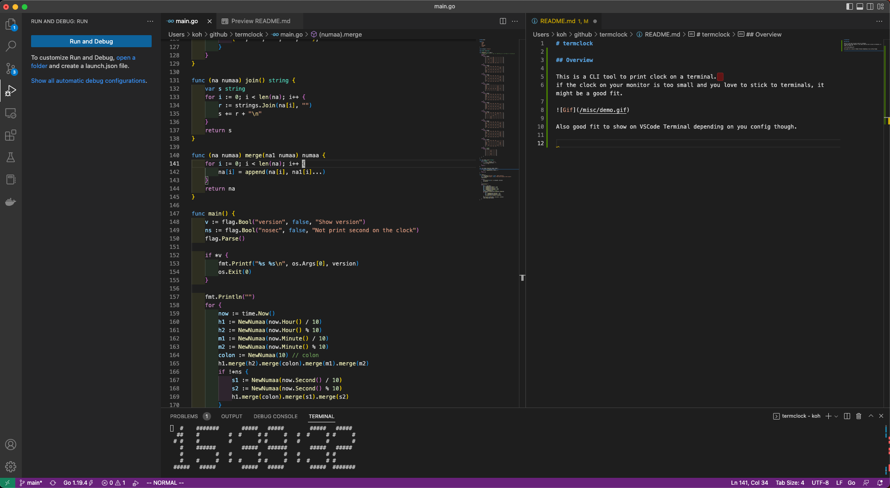

# termclock

## Overview

This is a CLI tool to print clock on a terminal.  
if the clock on your monitor is too small and you love to stick to terminals, it might be a good fit.


Also a good fit to print on VSCode Terminal depending on your config though.



## Install

```bash
go install github.com/koh-sh/termclock@latest
```

Or Access to [Releases](https://github.com/koh-sh/termclock/releases) and download binary.
